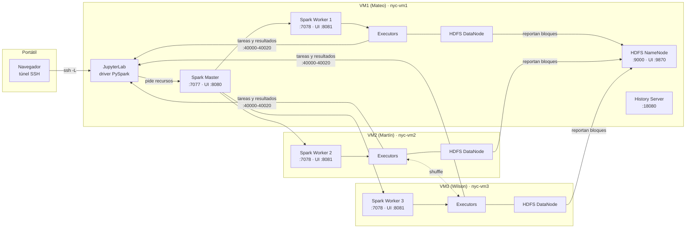
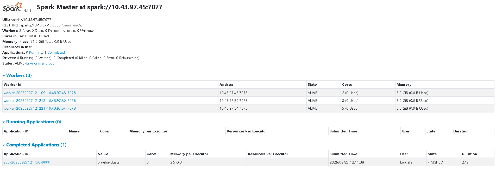
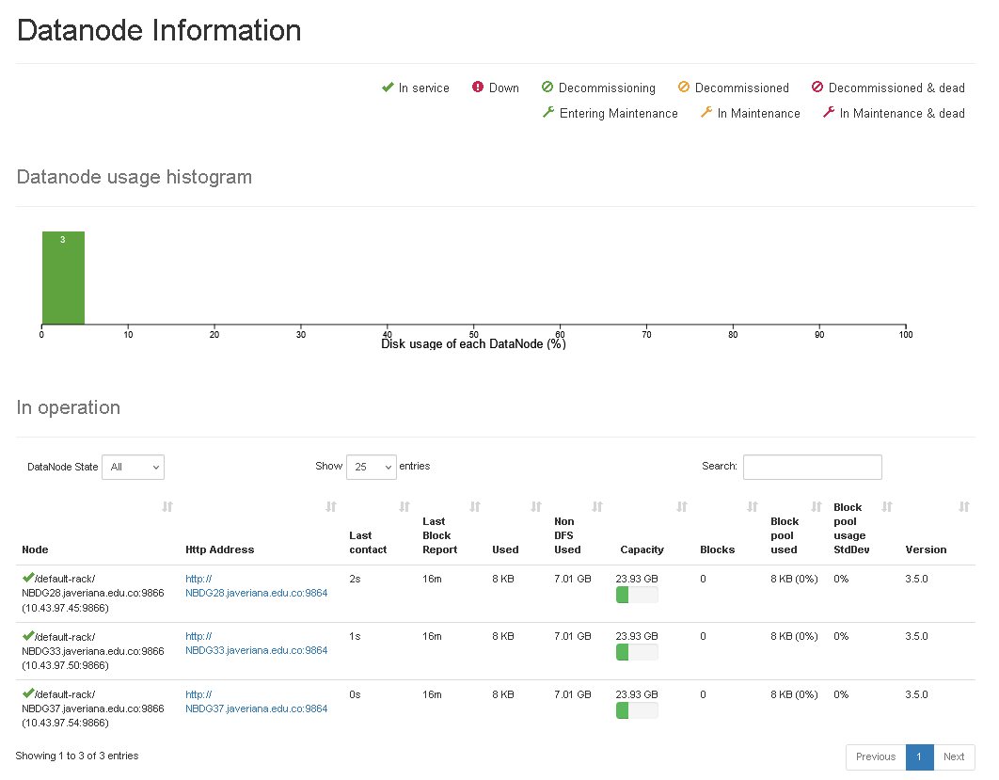

# Arquitectura del cluster Spark

Cómo está montado el cluster en el que se procesaron los datos, por qué se tomó cada decisión y
qué pasó durante la instalación. Los recursos de cada máquina salen de lo que mostró
`infra/00_diagnostico.sh` en las tres VMs.

## 1. Vista general

| Nodo | Procesos | Recursos que se le dan a Spark |
|---|---|---|
| VM1 (Mateo) | Master, Worker, Driver/Jupyter, NameNode, DataNode, History Server | 4 cores y 15,7 GB; worker de 2 cores y 5 GB |
| VM2 (Martín) | Worker, DataNode | 4 cores y 15,7 GB; worker de 3 cores y 8 GB |
| VM3 (Wilson) | Worker, DataNode | 4 cores y 15,7 GB; worker de 3 cores y 8 GB |

### Capturas del cluster funcionando (27 de septiembre de 2026)

Spark Master con los 3 workers vivos, 8 cores y 21 GiB. La aplicación de prueba usó los 8 cores:

HDFS con los 3 DataNodes en servicio, uno por VM, cada uno con 23,93 GB de capacidad:

## 2. Decisiones

### 2.1 Spark standalone y no YARN o Kubernetes
Spark trae su propio gestor de recursos (modo standalone): un master que sabe qué recursos hay
y unos workers que lanzan los executors en cada máquina. YARN hace lo mismo, pero agrega dos
procesos más (ResourceManager y NodeManager) que gastan memoria en VMs pequeñas y no aportan
nada cuando un solo equipo usa el cluster. Además es el modo que se vio en el curso y el más
fácil de explicar.

### 2.2 Instalación directa y no Docker
Docker Compose solo maneja contenedores en una máquina. Para repartirlos entre varias VMs habría
que usar Docker Swarm con una red overlay, que es otra capa de red (y otra fuente de fallas)
encima de la red de la universidad. Con Spark instalado directamente en Rocky Linux, cada proceso
usa la IP real de su VM. La instalación se hace con los scripts de `infra/`, así que se puede
repetir igual en cualquier VM.

### 2.3 Qué hace cada VM
- VM1 tiene el master, un worker y el driver. El driver es el proceso de Python de Jupyter:
  coordina el trabajo y recibe los resultados (`collect`, `toPandas`). Conviene que esté junto al
  master y en la VM donde trabajamos. VM1 también es worker para no desperdiciar sus cores.
- VM2 y VM3 son solo workers; todo lo que tienen va para executors.
- Por eso VM1 le da a Spark menos cores y memoria que las otras dos: además carga el driver, el
  master y el NameNode.
- Los scripts funcionan con cualquier número de VMs. Para agregar una basta con sumar una
  posición a las listas de `infra/cluster.env`.

### 2.4 Modo client desde Jupyter
En Jupyter el driver corre dentro del kernel del notebook (modo client). En modo cluster el
driver correría en un worker y no se podrían ver los resultados celda por celda.

### 2.5 Datos compartidos con HDFS
Todos los executors tienen que poder leer los mismos archivos con la misma ruta. Había dos
opciones:

| | A. HDFS | B. Copia local en cada VM |
|---|---|---|
| Lectura | cada executor lee sus bloques | cada executor lee su copia |
| Escritura (Parquet intermedio) | un solo resultado completo | cada executor escribe sus particiones en su propio disco y el resultado queda repartido entre las VMs |
| Espacio en disco | el doble (replicación 2) | el triple (una copia por VM) |
| RAM extra | 1 a 1,5 GB (NameNode y DataNode) | nada |
| Montaje | un script más | copiar con `rsync` cada vez que cambian los datos |

Lo que decidió fue la escritura. El proyecto guarda datos intermedios en Parquet (capas bronce,
plata y oro), y con rutas locales (`file://`) un `df.write.parquet(...)` deja un pedazo de los
archivos en cada VM sin que ninguna tenga el resultado completo. Con HDFS eso no pasa, así que
escogimos la opción A.

Así quedó organizado HDFS (todas las capas en Parquet menos la cruda):

| Ruta | Capa | Contenido |
|---|---|---|
| `/nyc/raw/<fuente>/` | cruda | los CSV tal como se descargan de NYC Open Data |
| `/nyc/bronze/<fuente>/` | bronce | lo mismo en Parquet, todas las columnas como texto y con nombres normalizados |
| `/nyc/silver/<fuente>/` | plata | tipos correctos, periodo filtrado y limpieza |
| `/nyc/gold/<tabla>/` | oro | agregados por borough, barrio y día para el análisis y los modelos |

Con las capas separadas se puede rehacer cualquier paso sin volver a descargar nada, y queda
claro qué se transformó en cada etapa.

Usamos replicación 2: cada bloque de 128 MB queda en 2 de las 3 VMs, así que si una se apaga no
se pierde nada. Con replicación 3 todas las lecturas serían locales, pero ocuparía un 50 % más
de disco. Con 2 réplicas Spark igual intenta mandar cada tarea a una VM que tenga el bloque
(data locality), entonces casi todas las lecturas siguen siendo locales.

### 2.6 Puertos fijos y firewall apagado
Por defecto, el driver y el block manager de Spark escogen puertos al azar, y así no hay forma
de saber qué puertos usa el cluster; con firewall habría que abrirlo todo. Por eso se fijan
(`spark.driver.port`, `spark.blockManager.port`) en un rango pequeño y conocido (sección 5). Las
interfaces web se abren desde el portátil con un túnel SSH.

El 27 de septiembre decidimos dejar firewalld apagado, como vienen las VMs de la universidad.
Eso significa que los puertos del cluster se pueden alcanzar desde cualquier equipo de la red de
la universidad. Lo aceptamos porque los datos son públicos (NYC Open Data), las VMs solo se
alcanzan desde dentro de esa red, y lo más delicado, JupyterLab, que permite ejecutar código,
solo escucha en `127.0.0.1` y pide token.

### 2.7 systemd y no `start-all.sh`
`start-all.sh` y `start-dfs.sh` entran por SSH a cada nodo y necesitan llaves sin contraseña
entre las VMs. Con servicios de systemd cada VM arranca sus propios procesos, estos se reinician
solos si fallan o si la VM se reinicia, y los logs quedan en `journalctl -u nyc-spark-worker`.

### 2.8 El mismo entorno en todas las VMs
Los executors de VM2 y VM3 también corren código de Python (UDFs, pandas), así que necesitan la
misma versión de Python y de las librerías que el driver; si no, PySpark falla con errores de
versión o de serialización. Por eso hay un entorno virtual en la misma ruta (`/opt/nyc-venv`) en
las tres VMs, y PySpark se toma de la instalación de Spark y no de pip.

## 3. Versiones

| Componente | Versión | Por qué |
|---|---|---|
| Rocky Linux | 9 (9.8 en VM2 y VM3) | son las VMs de la universidad |
| OpenJDK | 17 (LTS) | Spark 4 pide Java 17 o 21, y Hadoop 3.5 funciona con 17 |
| Apache Spark | 4.1.3 (`bin-hadoop3`) | última versión de mantenimiento de la rama 4.1; la 4.2.0 acababa de salir |
| Apache Hadoop (HDFS) | 3.5.0 | primera rama con soporte oficial para Java 17 |
| Python | 3.11 | PySpark 4.1 pide 3.10 o más y Rocky trae 3.9 |
| Scala | 2.13 | viene con Spark 4 |

## 4. Recursos

### Reglas que usamos
1. Sistema operativo: 1 core y unos 1,5 GB por VM.
2. HDFS: 1 GB por DataNode (en cada VM) y 1 GB más para el NameNode (en VM1).
3. Driver (VM1): 1 core y `DRIVER_MEMORY` más 1 GB (kernel de Python, Jupyter, `toPandas`).
4. Memoria del worker: lo que queda por 0,8. Ese 20 % libre es para el overhead de los executors
   y para los procesos de Python de PySpark, que corren fuera de la JVM y el worker no los cuenta.
5. Todos los executors del mismo tamaño, porque `spark.executor.cores` y `spark.executor.memory`
   son iguales para todo el cluster. Hay que escoger un tamaño que quepa un número entero de
   veces en cada worker.
6. `spark.sql.shuffle.partitions` de 2 a 3 veces el total de cores. El valor por defecto (200)
   está pensado para clusters grandes y aquí generaría muchas tareas diminutas. Como AQE está
   activado, Spark lo ajusta mientras corre.

### Valores finales (las tres VMs con 4 cores y 15,7 GB)

Cada executor ocupa su heap (`2560m`) más unos 384 MB de overhead por fuera, y cada tarea de
PySpark abre además un proceso de Python. Así se reparte la memoria en cada VM:

| | VM1 | VM2 | VM3 |
|---|---|---|---|
| Sistema operativo (medido en reposo) | ~2 GB | ~2 GB | ~2 GB |
| HDFS | NameNode y DataNode: 2 GB | DataNode: 1 GB | DataNode: 1 GB |
| Driver: heap de 3 GB, overhead y Jupyter | ~4,5 GB | | |
| Executors (1 core, 2,5 GB más 0,4 GB de overhead) | 2, unos 5,8 GB | 3, unos 8,7 GB | 3, unos 8,7 GB |
| Total ocupado | ~14,3 GB | ~11,7 GB | ~11,7 GB |
| Lo que sobra para los procesos de Python | ~1,4 GB | ~4 GB | ~4 GB |

| Parámetro | Valor | Por qué |
|---|---|---|
| `WORKER_CORES` | 2, 3 y 3 | 1 core por VM para el sistema, y en VM1 otro para el driver |
| `WORKER_MEMORY` | 5g, 8g y 8g | lo justo para 2 o 3 executors de 2,5 GB |
| `EXECUTOR_CORES` / `EXECUTOR_MEMORY` | 1 / 2560m | ese tamaño cabe exacto en workers de 2 y de 3 cores |
| `DRIVER_MEMORY` | 3g | alcanza para `toPandas()` de resultados agregados, nunca de tablas completas |
| `SHUFFLE_PARTITIONS` | 24 | 3 por cada uno de los 8 cores; AQE las ajusta al correr |

En total el cluster tiene 8 executors, 8 cores y 20 GB de memoria para ejecutar. VM1 es la que
queda con menos margen: si Jupyter se queda sin memoria, lo primero es bajar el `WORKER_MEMORY`
de VM1 a `2560m`, es decir, un solo executor.

## 5. Puertos

| Puerto | Proceso | VM | Quién se conecta |
|---|---|---|---|
| 7077 | Spark Master (RPC) | VM1 | VM2 y VM3 |
| 8080 | UI del master | VM1 | otras VMs o túnel SSH |
| 7078 | Spark Worker (RPC) | todas | otras VMs |
| 8081 | UI del worker | todas | otras VMs o túnel |
| 4040 | UI de la aplicación (driver) | VM1 | otras VMs o túnel |
| 40000 | `spark.driver.port` | VM1 | VM2 y VM3 |
| 40001 | `spark.driver.blockManager.port` | VM1 | VM2 y VM3 |
| 40010-40020 | `spark.blockManager.port` (executors, shuffle) | todas | otras VMs |
| 9000 | HDFS NameNode (RPC) | VM1 | VM2 y VM3 |
| 9870 | UI del NameNode | VM1 | otras VMs o túnel |
| 9864 / 9866 / 9867 | HDFS DataNode (HTTP, datos, IPC) | todas | otras VMs |
| 18080 | Spark History Server | VM1 | túnel |
| 8888 | JupyterLab | VM1 | solo 127.0.0.1 (túnel) |

## 6. Pasos para montar el cluster

| Paso | Script | VM1 | VM2 | VM3 |
|---|---|---|---|---|
| 0 | `bash infra/00_diagnostico.sh` y llenar `infra/cluster.env` | sí | sí | sí |
| 1 | `bash infra/01_prueba_red.sh escuchar/probar` (todos los pares, en los dos sentidos) | sí | sí | sí |
| 2 | `sudo bash infra/02_base.sh` (Java, Python, usuario, /etc/hosts, venv) | sí | sí | sí |
| 4 | `sudo bash infra/04_spark.sh` | sí | sí | sí |
| 5 | `sudo bash infra/05_hdfs.sh` | sí | sí | sí |
| 6 | `sudo bash infra/06_servicios.sh` (primero en VM1) | sí | sí | sí |
| 7 | `sudo bash infra/07_verificar.sh` | sí | | |

No hay paso 3 porque era el script del firewall, y se quitó cuando decidimos dejarlo apagado
(sección 2.6).

Cada script muestra lo que va a cambiar y pide confirmación antes de hacerlo. Se pueden correr
varias veces sin problema.

## 7. Registro de la instalación

| Fecha | Qué pasó | Detalle |
|---|---|---|
| 27-sep-2026 | Diagnóstico de VM1 (10.43.97.45) | Rocky 9, 4 cores Xeon Gold 6348, 15,7 GB de RAM, 20 GB libres en `/`, firewalld inactivo, SELinux en Enforcing, Java 8, Python 3.9, sudo con contraseña |
| 27-sep-2026 | Diagnóstico de VM2 (NBDG37, 10.43.97.54) | Rocky 9.8, 4 cores Xeon Gold 6240R, 15,7 GB de RAM, 20 GB libres en `/`, firewalld inactivo, SELinux en Enforcing, Java 8, Python 3.9, sudo con contraseña. La IP que teníamos al principio (.171) estaba mal |
| 27-sep-2026 | Diagnóstico de VM3 (NBDG33, 10.43.97.50) | Rocky 9.8, 4 cores Xeon Gold 6240R, 15,7 GB de RAM, 24 GB en `/` (21 libres), `/var` y `/home` de 15 GB cada uno, firewalld inactivo, SELinux en Enforcing. Java 8 y Python 3.9 ya estaban; se agregaron Java 17 y Python 3.11 sin tocar los que había. Red 10.43.96.0/20 |
| 27-sep-2026 | Prueba de red entre los 3 pares, en los dos sentidos | Las 6 pruebas salieron bien |
| 27-sep-2026 | Instalación en las 3 VMs | HDFS quedó bien (3 DataNodes, replicación 2), pero Spark no tenía ningún worker. La causa: el listener de `01_prueba_red.sh` había quedado vivo en el puerto 7077 de VM1, el master se pasó al 7078 y los workers le hablaban al listener ("Too large frame"). Se detuvo el listener y se reiniciaron master y workers. Para que no vuelva a pasar, el listener ahora se apaga solo a los 10 minutos, los procesos de Spark ya no cambian de puerto (`spark.port.maxRetries=0`) y `06_servicios.sh` revisa que los puertos estén libres antes de arrancar |
| 27-sep-2026 | Cluster verificado con `07_verificar.sh` | 3 workers ALIVE (8 cores, 21 GB), 3 DataNodes, bloque de prueba con 2 réplicas (VM1 y VM2), 200 tareas repartidas entre las 3 VMs (VM2: 94, VM3: 92, VM1: 14) y 2.000.000 de líneas leídas desde HDFS en 19,1 s con 8 executors |
| 27-sep-2026 | Capacidad de HDFS (UI del NameNode) | 3 DataNodes en servicio, versión 3.5.0. Cada nodo tiene 23,93 GB, de los que el sistema y las instalaciones ocupan 7,01 GB; quedan unos 16,9 GB libres por nodo, 50 GB en total. Con replicación 2 caben unos 25 GB de datos |
| 27-sep-2026 | Descarga de las fuentes a HDFS (`/nyc/raw`) | 7 archivos, unos 2,5 GB en total, a 1-2 MB/s (el último terminó a las 17:55 UTC). Los conteos de líneas coinciden con lo publicado en NYC Open Data |
| 27-sep-2026 | Primera ejecución completa de los notebooks (`scripts/ejecutar_notebooks.sh`) | 5 notebooks sin errores en 11 minutos. Ingesta 220 s (6,26 millones y 0,14 millones de arrestos, 2,27 millones de choques y 4,55 millones de vehículos a Parquet, con compresión de 2,6 a 5,2 veces), calidad 94 s, limpieza 133 s (1.608.509 arrestos, 846.420 choques y 1.710.836 vehículos en el periodo), descripción 117 s y exploración 70 s |
